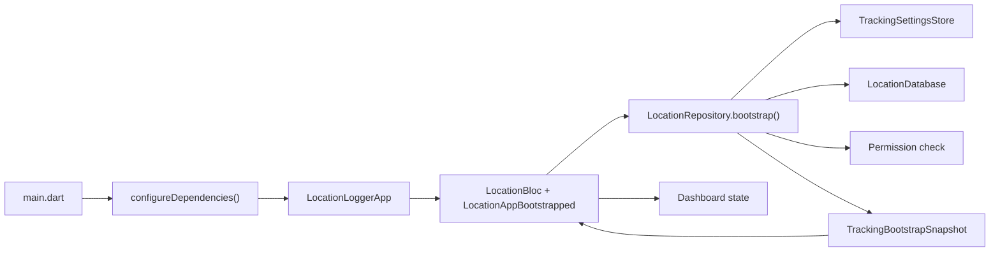
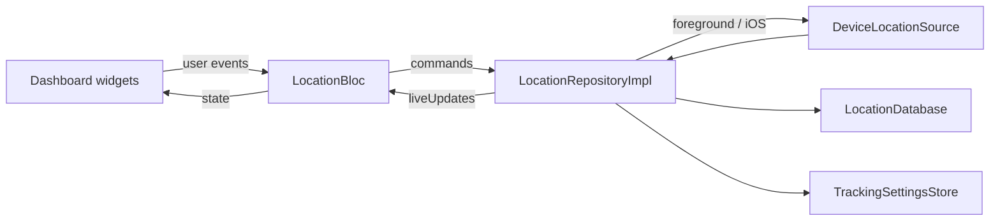
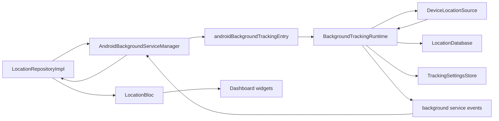
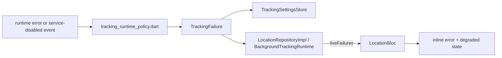

# Architecture Guide

This document is the engineer-facing map of the project. It explains where code lives, how the app boots, how tracking is started and stopped, and how location data moves through the system.

## Mental Model

The app has one feature with one main orchestration point:

- The UI sends events to `LocationBloc`.
- `LocationBloc` delegates all runtime work to `LocationRepository`.
- `LocationRepositoryImpl` chooses the active tracking runtime and coordinates storage.
- `LocationDatabase` keeps durable history.
- `TrackingSettingsStore` keeps lightweight state needed for fast restore.

There are two tracking runtime paths:

- Direct runtime: used for foreground tracking on both platforms, plus iOS tracking while the app process stays alive. The repository listens to `DeviceLocationSource` directly in the app process.
- Android background runtime: used when Android background tracking is requested. The repository starts `flutter_background_service`, and the background isolate runs `BackgroundTrackingRuntime`.

## Key Terms

- `trackingEnabled`: whether tracking is currently supposed to be running.
- `backgroundEnabled`: the user's saved preference requesting background-capable tracking.
- `effectiveBackgroundEnabled`: whether background tracking is actually available right now given the current permission state.

This distinction matters. A user can request background tracking, but the app may temporarily or permanently fall back to foreground-only behavior.

## File/Folder Structure

```text
lib/
  main.dart                              # Flutter entrypoint
  app.dart                               # Root widget and top-level BlocProvider
  core/
    di/
      injection.dart                     # GetIt registration and startup wiring
    theme/
      app_theme.dart                     # Shared Material theme
    utils/
      date_time_formatter.dart           # UI formatting helpers
      platform_info.dart                 # Platform checks used by runtime decisions
  features/
    location_tracking/
      domain/
        entities/
          location_sample.dart           # Core location record model
        models/
          tracking_bootstrap_snapshot.dart
          tracking_failure.dart
          tracking_permission_state.dart
          tracking_settings.dart
          tracking_start_result.dart
        repositories/
          location_repository.dart       # Feature contract used by Bloc
      data/
        repositories/
          location_repository_impl.dart  # Main orchestration layer
        services/
          device_location_source.dart    # Geolocator wrapper
          android_background_service.dart
          background_service_contract.dart
          background_tracking_entrypoint.dart
          background_tracking_runtime.dart
          notification_coordinator.dart
          tracking_runtime_policy.dart   # Permission/failure normalization rules
        storage/
          location_database.dart         # SQLite history storage
          tracking_settings_store.dart   # SharedPreferences-based settings store
      presentation/
        bloc/
          location_bloc.dart             # Feature state machine
          location_event.dart
          location_state.dart
        view/
          location_dashboard_page.dart   # Screen entrypoint
        widgets/
          location_status_card.dart
          tracking_controls_card.dart
          location_history_card.dart

test/
  features/
    location_tracking/
      data/                              # Repository, storage, runtime-policy tests
      presentation/                      # Bloc and widget tests

android/                                 # Android app shell and manifest/service config
ios/                                     # iOS app shell and background mode config
```

## Fastest Files To Read First

If you are new to the codebase, this is the shortest useful reading path:

1. `README.md`
2. `docs/architecture.md`
3. `lib/core/di/injection.dart`
4. `lib/features/location_tracking/presentation/bloc/location_bloc.dart`
5. `lib/features/location_tracking/data/repositories/location_repository_impl.dart`
6. `lib/features/location_tracking/data/services/background_tracking_runtime.dart`
7. `lib/features/location_tracking/data/storage/location_database.dart`
8. `lib/features/location_tracking/data/storage/tracking_settings_store.dart`

## Working Flow

### 1. App Startup And Bootstrap

1. `lib/main.dart` calls `configureDependencies()` and then launches `LocationLoggerApp`.
2. `lib/app.dart` creates `LocationBloc` from `GetIt` and immediately dispatches `LocationAppBootstrapped`.
3. `LocationBloc` subscribes to repository `liveUpdates` and `liveFailures`.
4. `LocationRepositoryImpl.bootstrap()` restores:
   - persisted tracking settings
   - current permission state
   - recent SQLite samples
   - last known sample from preferences
   - last structured tracking failure
5. Bootstrap normalizes invalid saved background preference when the OS no longer allows it.
6. If saved tracking should still be active, the bloc asks the repository to start tracking again.



### 2. Start, Stop, And Settings Changes

The dashboard never talks to platform APIs directly. Everything goes through the bloc and repository.

1. `TrackingControlsCard` emits user actions.
2. `LocationBloc` converts those actions into repository calls.
3. The repository checks permission requirements and persists the latest settings.
4. The repository picks the runtime:
   - Android + background requested: start `AndroidBackgroundServiceManager`
   - Anything else: start direct `DeviceLocationSource.positionStream(...)`
5. If sample interval, distance filter, or background preference changes while tracking is active, the bloc persists the new setting and restarts the runtime so the change applies immediately.
6. On stop, the repository disables tracking, cancels subscriptions, and stops the Android service if needed.

### 3. Runtime Failure And Recovery

Both runtime paths watch for more than just location samples:

- They listen for location stream errors.
- They listen for device-wide location service disable events.
- They classify failures through `tracking_runtime_policy.dart`.

When a failure happens:

1. The runtime classifies the failure and normalizes saved settings.
2. The app persists the structured failure to preferences.
3. Tracking is stopped.
4. A failure event is emitted back to the foreground app.
5. `LocationBloc` updates the UI with the inline error and any background-mode downgrade message.

The dashboard also refreshes on app resume through `AppLifecycleListener`, so returning from system settings rehydrates the latest permission and runtime state.

### 4. Background Downgrade Behavior

One important behavior is intentionally user-friendly:

- If background tracking was requested, but the app still has foreground permission, the bloc downgrades to foreground tracking instead of stopping completely.
- If the permission state permanently invalidates background tracking, the saved background preference is cleared and the toggle is locked until the permission is restored.
- If the issue is transient, such as location services being off, the saved background preference is preserved.

## Data Flow

### Persistence Responsibilities

Two storage layers exist on purpose:

- `LocationDatabase` stores durable location history in SQLite table `location_logs`.
- `TrackingSettingsStore` stores lightweight state in `SharedPreferencesAsync`:
  - tracking settings
  - last known sample
  - last structured failure

This split keeps the history durable and queryable while making dashboard restore fast and simple.

### Live Sample Flow



### Android Background Service Flow



### Failure Data Flow



## Platform Notes

- Android background mode is implemented with a foreground service and a dedicated background isolate.
- iOS uses the direct runtime path and depends on the app process remaining alive. Explicit force-quit is not treated as a guaranteed continuous-tracking case.
- Android and iOS share the same repository, bloc, settings, and history model. The runtime selection is where the platform behavior diverges.

## Where To Change Things

- UI layout or labels: `presentation/view` and `presentation/widgets`
- Dashboard state behavior: `presentation/bloc/location_bloc.dart`
- Permission mapping or downgrade rules: `data/services/tracking_runtime_policy.dart`
- Runtime selection and orchestration: `data/repositories/location_repository_impl.dart`
- Android foreground service behavior: `data/services/android_background_service.dart`, `background_tracking_entrypoint.dart`, `background_tracking_runtime.dart`
- SQLite schema or history loading: `data/storage/location_database.dart`
- Persisted settings, last sample, or failure restore: `data/storage/tracking_settings_store.dart`
- Dependency lifecycle: `core/di/injection.dart`
- Regression coverage: matching files under `test/features/location_tracking`
